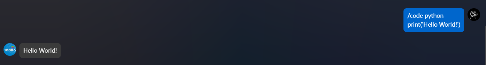
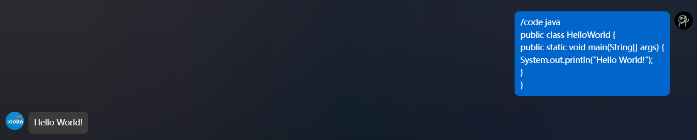
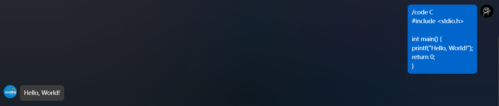

# AstrBot_Codex

<div align="center">
  
  
  
</div>

## 项目介绍

AstrBot_Codex 是一个基于 Docker 的 Linux 命令执行插件，专为 AstrBot 开发，能够安全地在隔离的 Docker 容器中执行多种编程语言的代码并返回结果。

### 支持的语言
- Shell
- Python
- Java
- C

## 安装与配置

1. 确保您的系统已安装 Docker ，若你的astrbot使用容器部署，请确保容器已将`docker.sock`进行映射
```bash
sudo docker run -itd \
  -p 6180-6200:6180-6200 \
  -p 11451:11451 \
  -v $PWD/data:/AstrBot/data \
  -v /var/run/docker.sock:/var/run/docker.sock \
  --name astrbot \
  soulter/astrbot:latest
```
2. 克隆此仓库到 AstrBot 的插件目录
3. 安装所需依赖：
astrbot会自动安装插件依赖，如果安装失败，可手动安装：
```bash
pip install -r requirements.txt
```
4. 启动 AstrBot，插件将自动加载

## Docker 镜像设置

本项目使用以下 Docker 镜像：
- 无镜像加速：`tuf3i/code_exec`
- 有镜像加速（推荐）：`docker.xuanyuan.me/tuf3i/code_exec`

您可以在 `dockerSupport.py` 文件中手动设置是否使用镜像加速：
```python
# 在 main.py 中修改这一行
self.dockerEnv = dockerSupport(useXuanYuanMirror=True)  # True 表示使用镜像加速，False 表示不使用
```

## 使用方法

### 命令格式
```
/code <语言类型>
<代码>代码内容
```

### 示例

#### Shell
```
/code shell
echo "Hello, World!"
```

<div align="center">
  
</div>

#### Python
```
/code python
print("Hello, World!")
```

<div align="center">
  
</div>

#### Java
```
/code java
public class HelloWorld {
    public static void main(String[] args) {
        System.out.println("Hello, World!");
    }
}
```

<div align="center">
  
</div>

#### C
```
/code C
#include <stdio.h>

int main() {
    printf("Hello, World!\n");
    return 0;
}
```

<div align="center">
  
</div>

### 帮助命令
```
/code help
```

## 实现原理

1. **请求接收**：插件接收用户发送的代码执行请求
2. **代码处理**：将代码进行 Base64 编码以确保传输安全
3. **容器执行**：在 Docker 容器中运行相应语言的解释器/编译器执行代码
4. **结果返回**：将执行结果进行 Base64 编码后返回给用户

项目通过 Docker 容器提供隔离的执行环境，确保系统安全，防止恶意代码对主机系统造成损害。

## 语言支持测试表

| 语言 | 支持状态 | 测试结果 | 所需依赖 |
|------|----------|----------|----------|
| Shell | ✅ 完全支持 | 通过 | bash |
| Python | ✅ 完全支持 | 通过 | python3 |
| Java | ✅ 完全支持 | 通过 | openjdk-17-jdk |
| C | ✅ 完全支持 | 通过 | build-essential (gcc) |

## 注意事项

1. 插件没有实现命令黑名单机制，为了系统安全，请不要执行危险的命令
2. 代码执行有一定的资源限制，请不要执行耗时过长或资源消耗过大的代码
3. 从第一个换行符处开始分割代码，所以在 `/code <language>` 后一定要先回车再输入命令
4. 不要使用对系统有害的命令

## 开发说明

如果您想参与开发或修改此插件，可以参考以下文件结构：

- `main.py`：插件主入口和命令注册
- `dockerSupport.py`：Docker 环境管理
- `exec.py`：代码执行逻辑
- `exec/main.py`：容器内执行脚本

## 许可证

本项目采用 MIT 许可证 - 详见 [LICENSE](LICENSE) 文件

## 作者

TuF3i

## GitHub 仓库

[https://github.com/TuF3i/astrBot_plugin_Codex](https://github.com/TuF3i/astrBot_plugin_Codex)